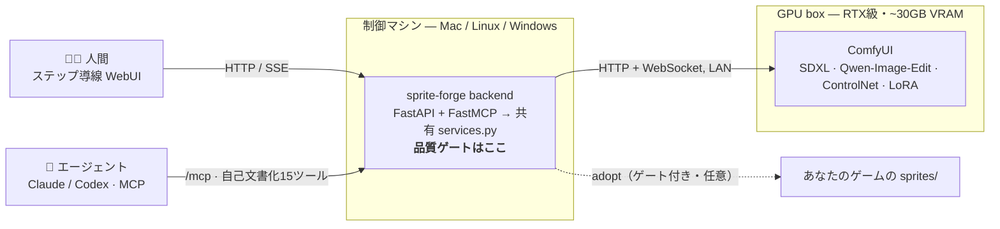

<p align="center">
  
</p>

# sprite-forge-mcp

[](LICENSE)
[](requirements.txt)
[](https://modelcontextprotocol.io)
[](https://github.com/comfyanonymous/ComfyUI)

[English](README.md) · **日本語**

> **発想を打つ → 透過済みのゲーム用キャラスプライトが出る。同じエンジンを、あなた(WebUI)でも、あなたのAIエージェント(MCP)でも動かせる。**

<p align="center">
  
</p>
<p align="center"><sub><b>キャラバイブル1枚</b>＝素体1枚から、一貫したターンアラウンド＋表情＋アクション＋別衣装。そして各スプライトはクリーンな透過RGBAで出力：</sub></p>
<p align="center">
  
</p>

`sprite-forge` はローカルの [ComfyUI](https://github.com/comfyanonymous/ComfyUI) スタジオ。テキストの発想を、透過 **RGBA スプライト** → **キャラバイブル**（設定資料）→ **キャラLoRA** → **任意ポーズ** まで作る。制作で痛い目を見たルールを**品質ゲートとして焼き込んである**ので、壊れたアセットは出荷前に弾かれる。

1つの Python バックエンドが **2つの顔**を持つ：人間向け**ステップ導線 WebUI** と、エージェント向け **FastMCP サーバ**（Claude / Codex / 任意の MCP クライアント）。両者は**同じ `backend/services.py`** を呼ぶので、どちらから来てもゲートを回避できない。重い生成は別マシンの ComfyUI が担い、バックエンドは決定的処理とゲート判定に徹する薄いオーケストレータ。

> *MCP = [Model Context Protocol](https://modelcontextprotocol.io)。Claude Code 等のエージェントにツールを差し込む公開標準。*

**状態：** 実機（RTX 5090 + Mac）で E2E 稼働中 — 淡色キャラ matte / キャラバイブル / キャラLoRA はいずれも動作。MIT。**CUDA GPU で動く ComfyUI が必須**（[要件](#要件)）。

## なぜ作ったか

画像モデルで小さなゲームのキャラスプライトを作るのは独特の苦痛で、自作RPGの制作でその全部を踏んだ：

- **クロマキーの黒漏れ** — 腕とリボンの隙間の「閉じた黒」が単純な flood-fill では残る。採用版1枚に **20万px超**の黒が残存したことも。
- **ダメージ版のズレ** — `-damaged` 版が再ポーズされて数px ずれ、ゲーム内でベースと重ならず CSS 配置が崩れる。*「元画像を1ドットもずらすな」*。
- **画風ドリフト** — レトロピクセルの必須語句を抜くと、艶のあるアニメ調に滑り落ちる。
- **手作業の修正は効かない** — 布/肌/輪郭を手で描き足す成功率はゼロ。
- **版の爆発** — 「どれが正解か」は主観なので、1枚が **v39** まで膨れ上がる。

だから sprite-forge は単にモデルを呼ぶのではなく、**その傷の一つ一つをゲートに変えている**。出力は四隅透過の RGBA を強制、ダメージ版は base と bbox **≤1px** で機械照合、必須画風語句は自動注入、**手描きツールは持たない**（マスク/点で指す＝モデルが再生成）、採用ゲートを通らない限りゲームフォルダには届かない。壊れたアセットが黙ってゲームに入ることはなく、**ゲートで弾かれる**。

## ComfyUI を直接使うのではダメなの？

ComfyUI はもう持っている＝ここでもそれがエンジン。sprite-forge は ComfyUI が持たない部分を足す：

- **二つの顔・一つのロジック** — 導線付き WebUI **と** エージェント用 MCP サーバが、同じゲート付きバックエンドを共有。AIエージェントがパイプライン全体を回せる＝ノードグラフを手配線しない。
- **単発画像でなくキャラのパイプライン** — 発想 → スプライト → *一貫した*バイブル → LoRA → 任意ポーズ、を一本の流れで。
- **製造ゲート** — 四隅透過 RGBA、ダメージ版 ≤1px 一致、必須画風、監査付き採用。素の ComfyUI は壊れたスプライトも平気で返すが、これは返さない。
- **再現可能・手描きなし** — マスク/点で指して再生成。手作業のピクセル救済はしない。

## アーキテクチャ



バックエンドは ComfyUI と同一マシンでも別マシンでも動く（`SPRITEFORGE_COMFY_URL` で指すだけ）。**ローカル推論は持たない**＝設計どおり。

## パイプライン

```
テキスト発想 → ① 素体スプライト → ② キャラバイブル → ③ キャラLoRA → ④ 任意ポーズ → 採用
```

1. **素体スプライト** — SDXL(Illustrious) txt2img ＋ matte → 透過 RGBA。任意で **AIプロンプト生成**：あなた自身の `claude`/`codex` CLI を呼んでラフ発想をタグプロンプトに展開（追加API課金なし）。白/淡色キャラは matte が崩れないよう高コントラスト背景に自動切替。
2. **キャラバイブル** — Qwen-Image-Edit の「マスターシート」1枚を一貫性アンカーに、ターンアラウンド＋表情＋アクション＋別衣装を生成。整列シート **＋ 自己完結HTML** で出力。
3. **キャラLoRA** — バイブルのパネルから1クリックで LoRA 学習。バックエンドが GPU box 上の kohya sd-scripts を SSH で駆動。
4. **任意ポーズ** — キャラLoRA 付き `generate_sprite` でそのキャラを新ポーズ/衣装で量産。`adopt` で採用版をゲームへ書き出し（不可逆・任意・ゲート付き）。

加えて **ダメージ版エディタ**（Qwen-Image-Edit の pose-lock ＋ 衣装マスクで bbox 完全一致）と **SAM2** 点マスク。

## 要件

これは **リモートGPUオーケストレータ＝単体では何も生成しない**。必要なのは：

- **CUDA GPU で動く ComfyUI**（HTTP+WS 到達可能）。**~30GB VRAM 目安**（RTX 5090 級）— 編集経路で ~20GB の DiT が常駐する。**小容量GPUでは現状そのままでは動かない**。
- **モデル一式** ＋ 必須カスタムノード（Qwen-Image-Edit, Union ControlNet）— **[docs/models.md](docs/models.md)**。
- backend 用に **Python 3.11+**。

## クイックスタート

> 完全なセットアップ（GPU box・モデル・任意機能・正直な制約）は **[INSTALL.md](INSTALL.md)**。

```bash
git clone https://github.com/kitepon-rgb/sprite-forge-mcp.git
cd sprite-forge-mcp
python3.12 -m venv .venv && . .venv/bin/activate     # 3.11+
pip install -r requirements.txt
cp .env.example .env                                  # SPRITEFORGE_COMFY_URL を自分の ComfyUI に
uvicorn backend.app:app --host 127.0.0.1 --port 8765
```

- **WebUI** → <http://127.0.0.1:8765/>  ·  **疎通** → `curl localhost:8765/api/gpu`
- **MCP** → `http://127.0.0.1:8765/mcp/` を Claude/Codex に URL 型サーバ登録。接続時に使い方マニュアルを返す。

## MCP ツール（エージェントの顔）

15ツールすべて WebUI と同じゲート付きサービスを共有。初期化時にパイプライン手順＋用語集を返す自己文書化済み。

| 分類 | ツール |
|---|---|
| Discovery / 状態 | `gpu_status` · `list_sprites` · `list_loras` |
| プロンプト | `craft_prompt`（あなたの `claude`/`codex` CLI を実行） |
| 生成 / 編集 | `generate_sprite` · `generate_variant` · `make_transparent` · `pixelize` · `fit_to_base` |
| キャラ | `generate_character_bible` · `bible_status` · `train_character_lora` |
| 画風LoRA | `train_style_lora` · `train_status` |
| 採用 | `adopt`（ゲート付きでゲームへ書き出し） |

## 設計原則（瘢痕ルール）

- **RGBA・四隅透過・黒背景禁止。** 透過は「願い」ではなくゲート。
- **ダメージ版は base と canvas/bbox ≤1px 一致**（denoise ロック・衣装マスクで 0px 保証）。
- **必須画風語句は自動注入**＝無言のドリフトを許さない。
- **手描きしない。** 指す（マスク/点/線）＝モデルが再生成。修正は再生成であって手作業の救済ではない。
- **静かなフォールバック禁止。** 失敗は段階と理由を明示。勝手に「直さない」。
- **採用は明示・不可逆。** 依頼があるときだけゲームプロジェクトへ書き出す。

## ドキュメント

- **[INSTALL.md](INSTALL.md)** — セットアップ・任意機能・正直な制約
- **[docs/models.md](docs/models.md)** — モデルの入手先・配置・必須ノード
- **[CLAUDE.md](CLAUDE.md)** — 実装の正典
- **[docs/](docs/)** — 設計ドキュメント（背景・調査・アーキ・出力契約 …）

## ライセンス

[MIT](LICENSE)。モデル重みは**含まない**＝各自でDL（[docs/models.md](docs/models.md)）。各モデルは独自ライセンス。
