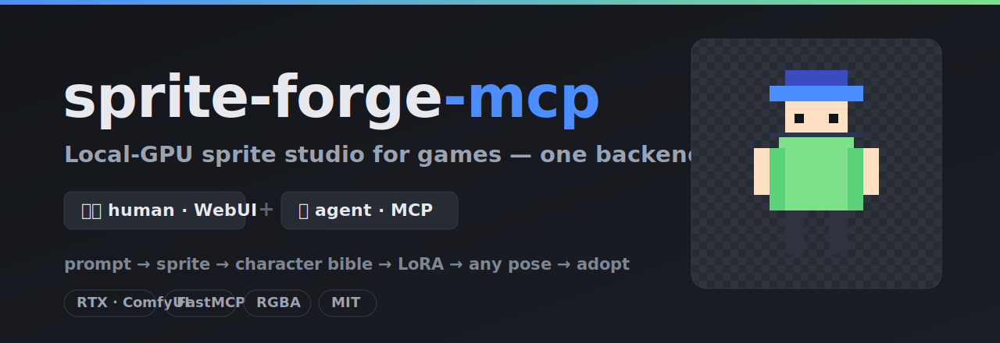
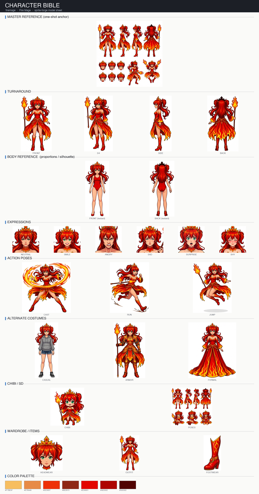
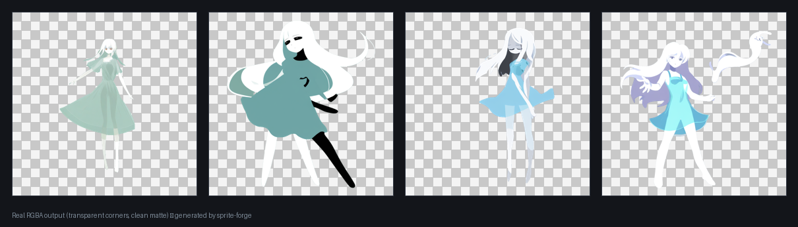
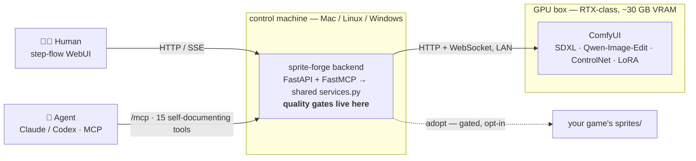

<p align="center">
  
</p>

# sprite-forge-mcp

[](LICENSE)
[](requirements.txt)
[](https://modelcontextprotocol.io)
[](https://github.com/comfyanonymous/ComfyUI)

**English** · [日本語](README.ja.md)

> **Type an idea → get a transparent, game-ready character sprite. Same engine, drivable by you (WebUI) or your AI agent (MCP).**

<p align="center">
  
</p>
<p align="center"><sub><b>One character bible</b>, generated from a single base sprite — a consistent turnaround + expressions + actions + alt costumes. And every sprite comes out as clean, transparent RGBA:</sub></p>
<p align="center">
  
</p>

`sprite-forge` is a local [ComfyUI](https://github.com/comfyanonymous/ComfyUI) studio that turns a text idea into a transparent **RGBA sprite**, a full **character bible**, a **character LoRA**, and then that character **in any pose** — with hard-won production rules baked into quality gates, so broken assets get caught before they reach your game.

One Python backend, **two faces**: a step-flow **WebUI** for humans and a **FastMCP server** for agents (Claude / Codex / any MCP client) — both calling the *same* `backend/services.py`, so the gates can't be bypassed from either side. Heavy generation runs on a remote ComfyUI GPU box; the backend is a thin orchestrator that does the deterministic, gate-keeping work.

> *MCP = [Model Context Protocol](https://modelcontextprotocol.io) — the open standard that lets agents like Claude Code plug capabilities into an AI.*

**Status:** runs end-to-end on a real RTX 5090 + Mac setup — the matte, character-bible, and character-LoRA pipelines are all working. MIT. Needs a CUDA GPU running ComfyUI (see [Requirements](#requirements)).

## Why

Making character sprites for a small game with image models is a special kind of pain, and I hit all of it shipping assets for my own RPG:

- **Chroma-key black leaks** — the "closed black" trapped between an arm and a ribbon survives a naive flood-fill; one accepted sprite had **200k+ leaked pixels**.
- **Damage-version drift** — the `-damaged` version comes back re-posed and a few pixels off, so it no longer lines up with the base in-game and the CSS layout breaks. *"Don't move the original by a single dot."*
- **Style drift** — drop the retro-pixel phrase and the model slides into glossy anime.
- **Manual touch-ups never work** — repainting cloth/skin/outline by hand had a success rate of zero.
- **The version explosion** — "which one looks right" is subjective, so one sprite ground out to **v39**.

So sprite-forge doesn't just call a model — it **turns each of those scars into a gate**. Outputs are forced to RGBA with transparent corners; damaged variants are machine-checked to match the base bbox within **≤1 px**; the mandatory style phrase is auto-injected; there is **no hand-paint tool** (you point with masks/dots, the model regenerates); and nothing reaches your game folder without passing the adopt gate. A broken asset can't silently reach your game — it fails a gate instead.

## Why not just use ComfyUI directly?

You already have ComfyUI — that's the engine here. sprite-forge adds the parts ComfyUI doesn't:

- **Two faces, one logic** — a guided WebUI *and* an MCP server for agents, sharing one gated backend. Your AI agent can run the whole pipeline end to end; you don't hand-wire node graphs.
- **A character pipeline, not one-off images** — idea → sprite → a *consistent* bible → LoRA → that character in any pose, as a single flow.
- **Production gates** — transparent-corner RGBA, ≤1 px damage-version alignment, mandatory style, audited adopt. Raw ComfyUI will happily hand you a broken sprite; this won't.
- **Reproducible, no hand-paint** — you point with masks/dots and regenerate; no manual pixel rescue.

## Architecture



The backend can run on the same machine as ComfyUI or a different one (it just needs `SPRITEFORGE_COMFY_URL`). It does **no local inference** — that is by design.

## The pipeline

```
text idea → ① base sprite → ② character bible → ③ character LoRA → ④ any pose → adopt
```

1. **Base sprite** — SDXL (Illustrious) txt2img + matte → transparent RGBA. Optional AI prompt-crafting expands a rough idea into a tag prompt by shelling *your own* `claude` / `codex` CLI (no extra API cost). Pale/white characters auto-switch to a high-contrast background so the matte stays clean.
2. **Character bible** — one Qwen-Image-Edit "master sheet" anchors a consistent turnaround + expressions + actions + alt costumes; exported as an aligned sheet **and** a self-contained HTML bible.
3. **Character LoRA** — train a LoRA from the bible's panels in one click; the backend drives kohya sd-scripts on the GPU box over SSH.
4. **Any pose** — `generate_sprite` with the character LoRA produces that character in new poses/outfits; `adopt` writes accepted sprites into your game (irreversible, opt-in, gated).

Plus a **damage/variant editor** (Qwen-Image-Edit with pose-lock + optional garment mask for pixel-exact bbox) and **SAM2** point-masking.

## Requirements

This is a **remote-GPU orchestrator — it does not generate anything by itself.** You need:

- A **CUDA GPU running ComfyUI**, reachable over HTTP+WS. Target **~30 GB VRAM** (RTX 5090 class) — the edit path co-loads a ~20 GB DiT. **Not runnable on a small GPU** as-is.
- The **model set** + required custom nodes (Qwen-Image-Edit, Union ControlNet) — see **[docs/models.md](docs/models.md)**.
- **Python 3.11+** for the backend.

## Quickstart

> Full setup (GPU box, models, optional features, honest limits) is in **[INSTALL.md](INSTALL.md)**.

```bash
git clone https://github.com/kitepon-rgb/sprite-forge-mcp.git
cd sprite-forge-mcp
python3.12 -m venv .venv && . .venv/bin/activate     # 3.11+
pip install -r requirements.txt
cp .env.example .env                                  # set SPRITEFORGE_COMFY_URL → your ComfyUI
uvicorn backend.app:app --host 127.0.0.1 --port 8765
```

- **WebUI** → <http://127.0.0.1:8765/>  ·  **health** → `curl localhost:8765/api/gpu`
- **MCP** → register `http://127.0.0.1:8765/mcp/` as a URL-type server in Claude/Codex; it returns a full usage manual on connect.

## MCP tools (the agent face)

All 15 tools share the same gated services as the WebUI. The server is self-documenting (it returns a pipeline manual + glossary on initialize).

| Group | Tools |
|---|---|
| Discovery / status | `gpu_status` · `list_sprites` · `list_loras` |
| Prompt | `craft_prompt` (shells your `claude`/`codex` CLI) |
| Generate / edit | `generate_sprite` · `generate_variant` · `make_transparent` · `pixelize` · `fit_to_base` |
| Character | `generate_character_bible` · `bible_status` · `train_character_lora` |
| Style LoRA | `train_style_lora` · `train_status` |
| Adopt | `adopt` (gated write into your game) |

## Design principles (the "scars")

- **RGBA, four transparent corners, never a black background.** Transparency is a gate, not a hope.
- **Damaged variants match the base canvas/bbox within ≤1 px** (denoise-locked; a garment mask guarantees 0 px).
- **The retro style phrase is mandatory and auto-injected** — no silent drift.
- **No hand-paint.** You point (mask / point / line); the model regenerates. Fixes are re-generation, never manual rescue.
- **No silent fallback.** Failures surface with the stage and reason; nothing is quietly "fixed."
- **Adopt is explicit and irreversible** — it writes into your game project only when you ask.

## Documentation

- **[INSTALL.md](INSTALL.md)** — setup, optional features, honest limitations
- **[docs/models.md](docs/models.md)** — model sources, placement, required ComfyUI nodes
- **[CLAUDE.md](CLAUDE.md)** — implementation reference (the source of truth)
- **[docs/](docs/)** — design docs (context, research, architecture, output contract, …)

## License

[MIT](LICENSE). Model weights are **not** included — download them yourself (see [docs/models.md](docs/models.md)); each model carries its own license.
